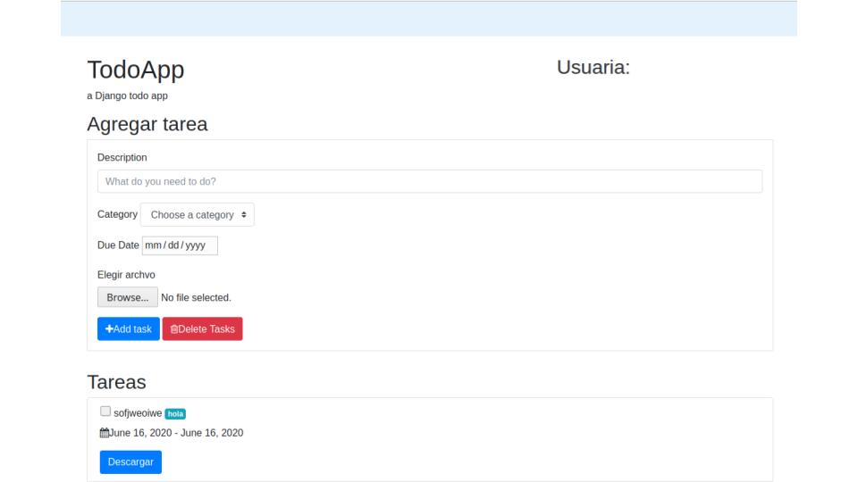

# Auxliar subir archivos a través de forms 

Vamos a agregar un campo para poner archivos adjuntos a una Task y luego podremos descargar el archivo con un botón. 

>Para correr este proyecto tienen que clonarlo en su computador, hacer 
>
>`$ pip install -r requirements.txt`
>
>`$ python manage.py migrate` 
>
>`$ python manage.py runserver`. 

## Preparar el proyecto para soportar archivos. 
> Antes de empezar a trabajar con archivos tenemos que configurar el proyecto para poder guardarlos y poder mostrarlos después en una url. 

En Django los archivos se guardarán en la carpeta MEDIA. 
Para esto hay que ir a todoapp/settings.py y agregar las siguientes líneas para crear las carpetas donde irá MEDIA:
    
    ```python
    MEDIA_URL = '/media/'
    MEDIA_ROOT = os.path.join(BASE_DIR, 'media')
    ```
  
Para que un usuario pueda acceder al archivo adjunto a través de una url habrá que habilitar las urls para el contenido de MEDIA, para esto haremos los siguientes pasos: 
    
* En el mismo archivo settings, en la configuración de TEMPLATES deberás agregar la siguiente línea en el diccionario de context_processors:
    ```python
      django.template.context_processors.media
    ```
  
* Luego en TODOS nuestros archivos de urls de las apps y del proyecto tenemos que agregar una línea alfinal de los urlpatterns y deberían quedar así: 
  ```python
      #agregamos estos imports
      from django.conf.urls.static import static 
      from django.conf import settings
  
      urlpatterns = [
          #paths
      ] +static(settings.MEDIA_URL, document_root=settings.MEDIA_ROOT) #agregamos esta última línea
    ```

## Agregar archivos, guardarlos y mostrarlos.
Para lograr el resultado de la imagen que vimos al inicio de este README, vamos a agregar un campo al modelo Task que se llamará adjunto. 
La idea es que se pueda adjuntar un archivo a una Task, y luego al mostrar la Task, se pueda descargar este archivo. 

* El primer paso para guardar archivos será que agregaremos el campo Ajunto a Task así: 
    ```python
        adjunto = models.FileField(upload_to='adjuntos/',blank=True, null= True)
    ```
    Lo que hacemos es crear un campo de tipo FileField, en `upload_to` diremos a qué carpeta se subirá el archivo y como no será obligación agregar un ajunto, dejaremos que el campo pueda ser blanco o nulo. 
    
    > Al agregar un nuevo campo hay que hacer makemigrations y migrate. 


* En index.html o el template donde queramos agregar un formulario con archivos hay que agregar `enctype="multipart/form-data` a la definición del formulario así:
    ```
     <form action="" method="post" enctype="multipart/form-data">
    ```
  > Es necesario que el formulario se mande por `post` o no funcionará. 

* Tenemos que crear el input para agregar un archivo. Para esto tendremos que decir que el input tiene `type="file"`: 

    ```html
        <!--Input para un archivo!-->
        <div class="form-group">
            <label for="exampleFormControlFile1">Elegir archvo</label>
            <input name="adjunto" type="file" class="form-control-file" id="exampleFormControlFile1">
        </div>
        <!--Fin input archivo!-->
    ```
    > Nota que al input le pusimos name *adjunto*, así podremos recuperar el archivo después. 
    
* Ahora queremos tomar el archivo que el usuario adjuntó y agregarlo a la Task al momento de crearla.  
    > Los archivos que vienen de un formulario se encontrarán en `request.FILES`. 
    `request.FILES` es un diccionario donde las llaves serán los name que se le de al input del archivo en el html.
    
    En views.py al momento de crear una Task (antes de hacer `Todo.save`) vamos a ver si hay un archivo adjunto
    y si hay, entonces lo agregaremos al campo `adjunto` de nuestra nueva Task llamada Todo.  
    > Nota que estamos accediendo al diccionario con el nombre que le dimos al input del archivo en el html. 
     ```python
    if request.FILES['adjunto']:
        adjunto = request.FILES['adjunto']
        Todo.adjunto = adjunto
    Todo.save()
    ```
     
* Finalmente, al mostrar la lista de Tasks, quisiéramos poder descargar el archivo que dejamos en adjunto. 
    Para esto en index.html, al mostrar las Tasks agregaremos la siguiente condición: 
    ```
    
      <a class="btn btn-primary" href="{{ todo.adjunto.url }}">Descargar</a>
    
    ```
    Este código verificará si hay un archivo adjunto en la task y creará un botón que dirige a la url de la Task. 
    
### Validar el tipo de archivo. 
La validación del tipo de archivo que se está adjuntando puede ir en diferentes capas de la aplicación. 

En *views.py* se puede tomar el nombre del archivo y validar que su extensión sea del tipo que estamos esperando y si no, hacer render de la página con un mensaje de error. 

También se puede agregar un validador en *models.py*, en la [documentación](https://docs.djangoproject.com/en/3.0/ref/validators/#fileextensionvalidator) encontrarán mas información. 

En el caso de estar usando *Forms* de Django, la validación también se podrá hacer en el Form.  


### Fin
Esto lo hice pensando en las cosas que ya les había explicado en auxiliares anteriores, por eso no utilicé Forms de Django. 
Si están trabajando con Forms de Django, les recomiendo ver [este tutorial](https://simpleisbetterthancomplex.com/tutorial/2016/08/01/how-to-upload-files-with-django.html) (que es de donde saqué gran parte de la info para esto). 
   
Quedará como tarea para ustedes ver cómo hacer para que el archivo se abra en el navegador, en un visualizador o que se descargue al apretar el botón. 

Éxito!
